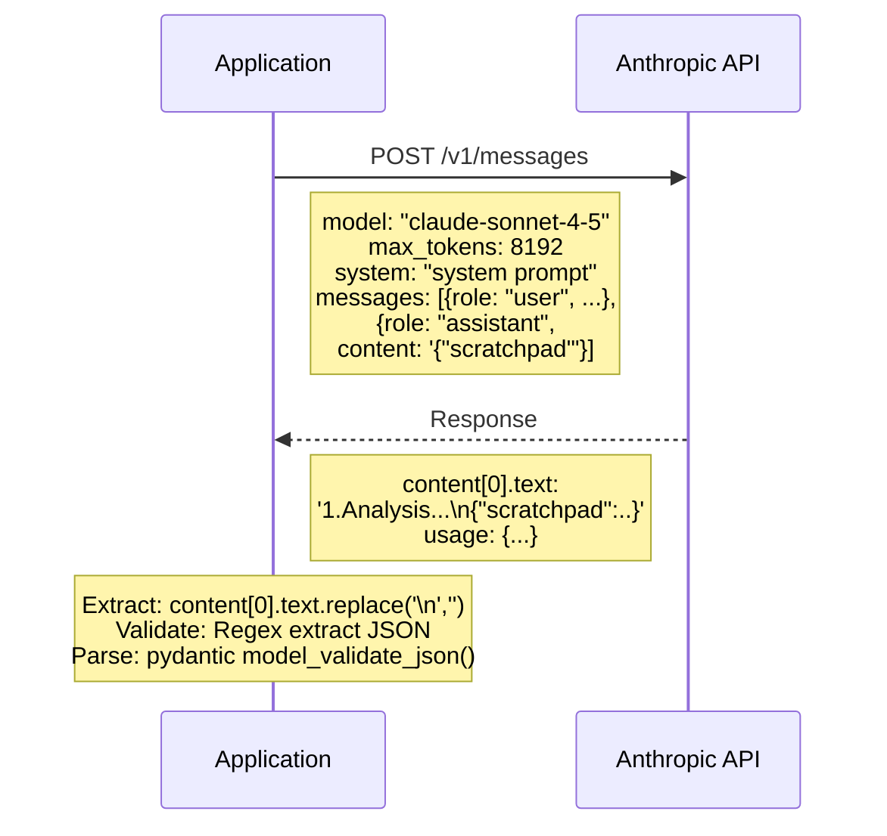
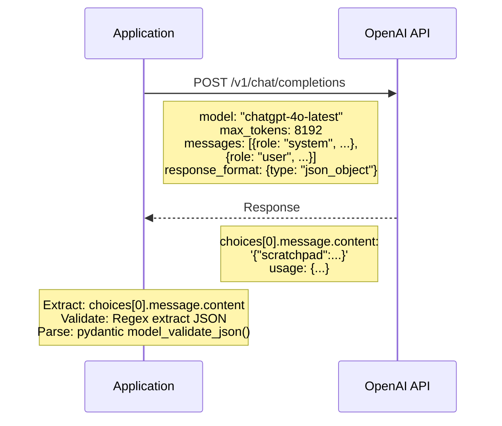
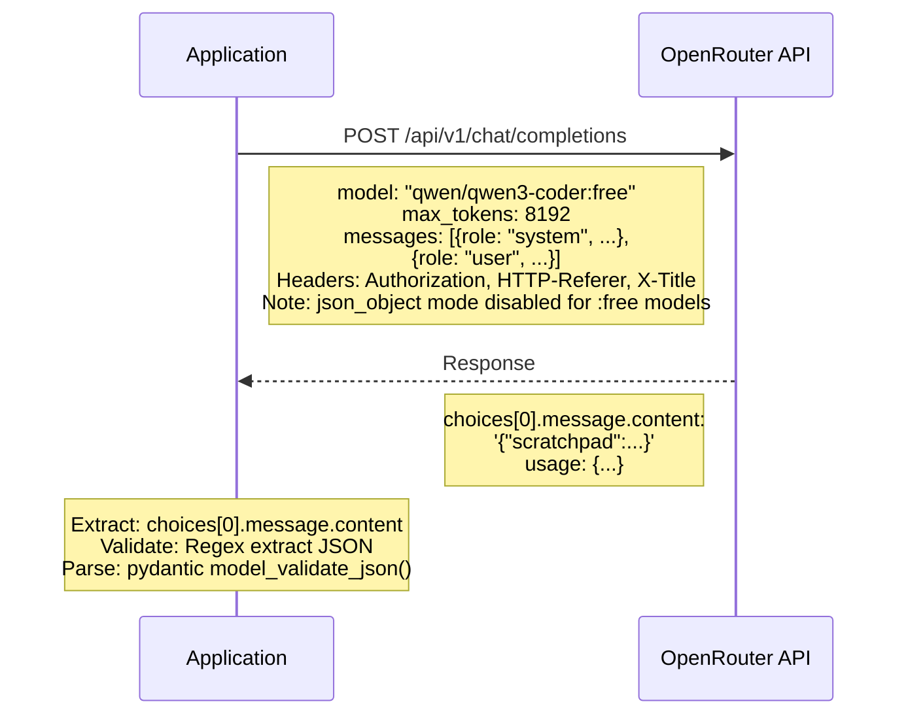
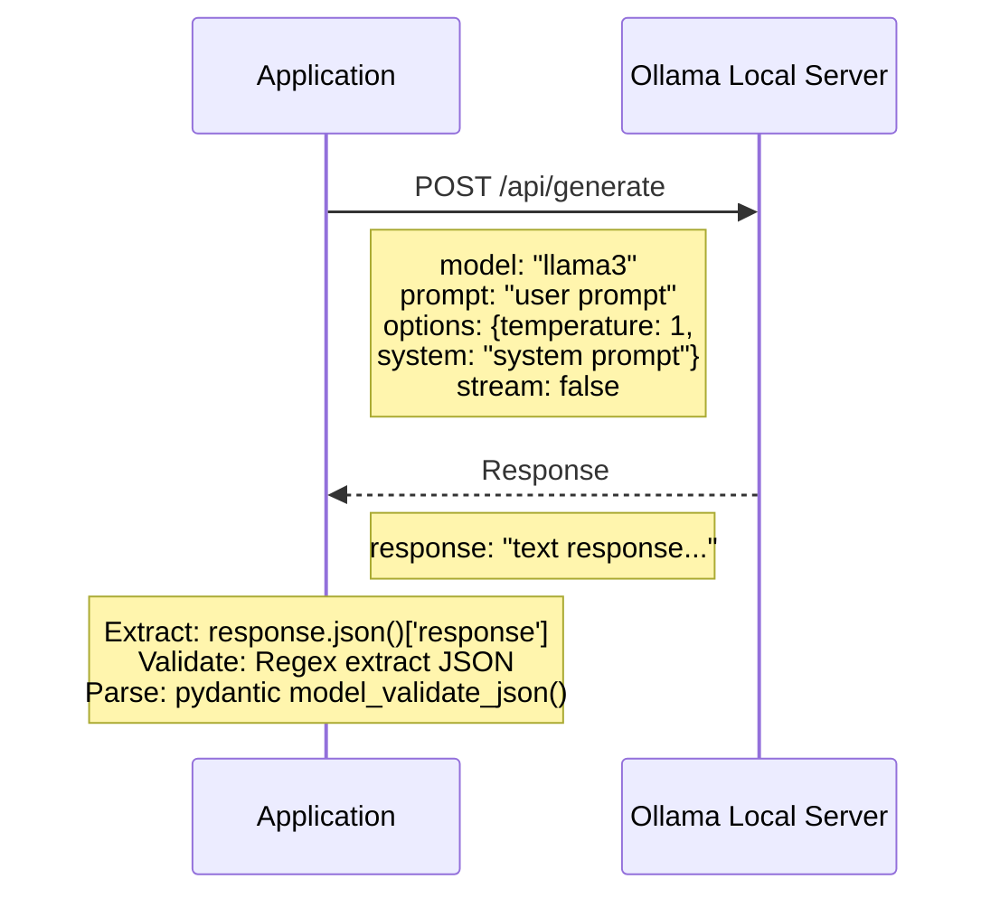

# Vulnhuntr Architecture Documentation

**Version**: 0.1.0  
**Last Updated**: February 4, 2026  
**Authors**: Dan McInerney, Marcello Salvati (Protect AI)

---

## Table of Contents

1. [Overview](#overview)
2. [System Architecture](#system-architecture)
3. [Component Architecture](#component-architecture)
4. [Data Flow](#data-flow)
5. [LLM Integration Architecture](#llm-integration-architecture)
6. [Analysis Pipeline](#analysis-pipeline)
7. [File Structure](#file-structure)
8. [Core Classes and Data Models](#core-classes-and-data-models)
9. [Configuration System](#configuration-system)
10. [Process Flow Diagrams](#process-flow-diagrams)

---

## Overview

### Purpose
Vulnhuntr is an autonomous static code analysis tool that leverages Large Language Models (LLMs) to identify remotely exploitable vulnerabilities in Python codebases. It analyzes complete code call chains from remote user input to server output, discovering complex, multi-step vulnerabilities that bypass traditional security controls.

### Key Capabilities
- **Supported Vulnerability Types**:
  - Local File Inclusion (LFI)
  - Arbitrary File Overwrite (AFO)
  - Remote Code Execution (RCE)
  - Cross-Site Scripting (XSS)
  - SQL Injection (SQLI)
  - Server-Side Request Forgery (SSRF)
  - Insecure Direct Object Reference (IDOR)

- **Supported LLM Providers**:
  - Anthropic Claude (recommended)
  - OpenAI GPT
  - Ollama (experimental)

### Technical Stack
- **Language**: Python 3.10+ (strictly requires 3.10-3.13 for Jedi compatibility)
- **Core Dependencies**:
  - `jedi` (0.19.2+): Python static analysis and symbol resolution
  - `parso` (0.8.5+): Python parser used by Jedi
  - `anthropic` (0.77.1+): Claude API client
  - `openai` (1.51.2+): OpenAI API client
  - `pydantic` (2.8.0+): Data validation and modeling
  - `pydantic-xml`: XML serialization for prompts
  - `structlog`: Structured logging
  - `rich`: Terminal output formatting

---

## System Architecture

### High-Level Architecture

```
┌─────────────────────────────────────────────────────────────────┐
│                        Vulnhuntr System                         │
├─────────────────────────────────────────────────────────────────┤
│                                                                 │
│  ┌───────────────┐      ┌──────────────┐      ┌─────────────┐ . │
│  │   CLI Entry   │─────>│  RepoOps     │─────>│  File       │ . │
│  │   (__main__)  │      │  (Repo Mgmt) │      │  Discovery  │ . │
│  └───────────────┘      └──────────────┘      └─────────────┘ . │
│         │                                              │        │
│         │                                              │        │
│         v                                              v        │
│  ┌───────────────┐      ┌──────────────┐      ┌─────────────┐   │
│  │ LLM Factory   │      │  Symbol      │      │  Prompt     │   │
│  │ (initialize)  │      │  Extractor   │      │  Templates  │   │
│  └───────────────┘      └──────────────┘      └─────────────┘   │
│         │                       │                      │        │
│         v                       │                      │        │
│  ┌──────────────────────────────┼──────────────────────┘        │
│  │                  LLM Clients │                               │
│  │           ┌──────────┐ ┌──────────┐ ┌──────────┐             │
│  │           │  Claude  │ │   GPT    │ │  Ollama  │             │
│  │           └──────────┘ └──────────┘ └──────────┘             │
│  └──────────────────────────────┼───────────────────────────────│
│                                 │                               │
│                             ┌───┘                               │
│                             v                                   │
│  ┌─────────────────────────────────────────────────────────┐    │
│  │                    Analysis Pipeline                    │    │
│  │  ┌──────────────┐  ┌──────────────┐  ┌──────────────┐   │    │
│  │  │   Initial    │─>│  Secondary   │─>│   Context    │   │    │
│  │  │   Analysis   │  │   Analysis   │  │   Expansion  │   │    │
│  │  └──────────────┘  └──────────────┘  └──────────────┘   │    │
│  └─────────────────────────────────────────────────────────┘    │
│                                                                 │
└─────────────────────────────────────────────────────────────────┘
                              │
                              v
                    ┌──────────────────┐
                    │  JSON Report +   │
                    │  Structured Log  │
                    └──────────────────┘
```

### Component Responsibilities

| Component | Responsibility | Input | Output |
|-----------|---------------|-------|--------|
| **CLI Entry** | Parse arguments, orchestrate flow | Command-line args | Execution control |
| **RepoOps** | Repository scanning, file filtering | Repository path | Filtered file list |
| **LLM Factory** | Create appropriate LLM client | LLM choice, config | LLM client instance |
| **Symbol Extractor** | Resolve Python symbols/definitions | Symbol names, code lines | Code definitions |
| **Prompt Templates** | Provide structured prompts | Analysis type | XML-formatted prompts |
| **LLM Clients** | Communicate with LLM APIs | Prompts, schemas | Structured responses |
| **Analysis Pipeline** | Iterative vulnerability analysis | File code, context | Vulnerability reports |

---

## Component Architecture

### 1. Entry Point (`__main__.py`)

**Purpose**: Main orchestration logic for the vulnerability scanning process.

**Key Functions**:
- `run()`: Main entry point that orchestrates the entire analysis pipeline
- `initialize_llm()`: Factory function to create appropriate LLM client
- `print_readable()`: Format and display analysis results
- `extract_between_tags()`: Parse XML-tagged content from responses

**Key Classes**:
- `VulnType`: Enum defining supported vulnerability types
- `Response`: Pydantic model for LLM responses
- `ContextCode`: Model for requested context code
- Various XML models for structured prompts (`FileCode`, `Instructions`, etc.)
- `RepoOps`: Repository operations handler

**Flow Control**:
1. Parse CLI arguments
2. Initialize repository operations
3. Filter files (network-related or user-specified)
4. Generate README summary
5. Perform initial analysis on each file
6. Conduct iterative secondary analysis with context expansion
7. Generate final report

---

### 2. LLM Integration (`LLMs.py`)

**Purpose**: Abstract LLM client implementations and handle API communication.

#### Base Class: `LLM`

```python
class LLM:
    system_prompt: str
    history: List[Dict[str, str]]
    prev_prompt: Union[str, None]
    prev_response: Union[str, None]
    prefill: Union[str, None]
```

**Methods**:
- `chat()`: Main interface for LLM interaction
- `_validate_response()`: Validate and parse JSON responses
- `_add_to_history()`: Track conversation history
- `_log_response()`: Log API usage information

**Response Validation Flow**:
```
LLM Response (text)
         │
         v
┌──────────────────┐
│  Add prefill if  │
│  it exists       │
└────────┬─────────┘
         │
         v
┌──────────────────┐
│ Regex extract    │
│ JSON from        │
│ markdown blocks  │  (Strip ```json...```)
└────────┬─────────┘
         │
         v
┌──────────────────┐
│ Pydantic model   │
│ validation       │
└────────┬─────────┘
         │
         v
   Validated JSON
```

#### Claude Client

**Specific Behavior**:
- Uses Anthropic's Messages API
- Implements **prefill technique**: Starts assistant response with `{"scratchpad": "1."`
- Does NOT use prefill for README summary requests
- System prompt passed separately from messages
- Returns response from `content[0].text` after stripping newlines

**API Configuration**:
```python
ANTHROPIC_BASE_URL = https://api.anthropic.com (default)
ANTHROPIC_API_KEY = <required>
ANTHROPIC_MODEL = claude-sonnet-4-5 (recommended)
```

**Message Structure**:
```python
# Regular analysis (with prefill)
messages = [
    {"role": "user", "content": user_prompt},
    {"role": "assistant", "content": "{    \"scratchpad\": \"1."}
]

# README summary (no prefill)
messages = [
    {"role": "user", "content": user_prompt}
]
```

#### ChatGPT Client

**Specific Behavior**:
- Uses OpenAI's Chat Completions API
- System prompt included in messages array
- Supports `response_format` parameter for JSON mode
- When `response_model` provided: `{"type": "json_object"}`
- Returns response from `choices[0].message.content`

**API Configuration**:
```python
OPENAI_BASE_URL = https://api.openai.com/v1 (default)
OPENAI_API_KEY = <required>
OPENAI_MODEL = chatgpt-4o-latest (recommended)
```

**Message Structure**:
```python
messages = [
    {"role": "system", "content": system_prompt},
    {"role": "user", "content": user_prompt}
]

# Parameters
{
    "model": model,
    "messages": messages,
    "max_tokens": max_tokens,
    "response_format": {"type": "json_object"}  # if response_model
}
```

#### Ollama Client

**Specific Behavior**:
- Uses Ollama's local generate API
- Does NOT use chat completions endpoint
- Uses `/api/generate` endpoint with prompt field
- System prompt passed in options
- Experimental - structured output unreliable

**API Configuration**:
```python
OLLAMA_BASE_URL = http://127.0.0.1:11434/api/generate (default)
OLLAMA_MODEL = llama3 (default)
OPENAI_API_KEY = not required
```

**Request Structure**:
```python
{
    "model": model,
    "prompt": user_prompt,  # Not messages array
    "options": {
        "temperature": 1,
        "system": system_prompt
    },
    "stream": False
}
```

#### Error Handling

All clients raise standardized exceptions:
- `APIConnectionError`: Server unreachable
- `RateLimitError`: Request rate-limited
- `APIStatusError`: Non-200 status code
- `LLMError`: Generic/validation errors

---

### 3. Symbol Resolution (`symbol_finder.py`)

**Purpose**: Use Jedi static analysis to locate and extract Python symbol definitions across the codebase.

#### SymbolExtractor Class

```python
class SymbolExtractor:
    repo_path: pathlib.Path
    project: jedi.Project
    parsed_symbols: None
    ignore: List[str] = ['/test', '_test/', '/docs', '/example']
```

**Core Method**: `extract(symbol_name, code_line, filtered_files)`

**Search Strategy** (executed in order):

1. **File Search** (`file_search()`):
   - Grep for `code_line` in files to narrow scope
   - Use `jedi.Script.search()` on matching files
   - Handles: functions, classes, statements, instances, modules
   - Returns immediately on first match

2. **Project Search** (`project_search()`):
   - Use `jedi.Project.search()` for workspace-wide search
   - Handles class instance variables: `var = ClassName(); var.method()`
   - Infers types and follows references

3. **All Names Search** (`all_names_search()`):
   - Fallback: `jedi.Script.get_names(all_scopes=True)`
   - Matches based on `full_name` or last part of symbol
   - Special case: matches code_line within name descriptions

**Edge Cases Handled**:
- Method calls on variables: `end_node = cast(BaseOperator, leaf_nodes[0]); end_node.call_stream()`
- Class instance variables: `multi_agents = MultiAgents(); multi_agents.method()`
- Aliased imports: `from service import Service as FlowService`
- Module symbols: `from api.apps import app`
- Code in name descriptions

**Return Format**:
```python
{
    'name': 'function_name',
    'context_name_requested': 'original_symbol_requested',
    'file_path': '/path/to/file.py',
    'source': 'def function_name():\n    ...'
}
```

**Special Handling**:
- Third-party libraries: Returns placeholder message
- No source available: Returns 'None'
- Excluded paths: Skips test/docs/examples

---

### 4. Prompt System (`prompts.py`)

**Purpose**: Provide structured, vulnerability-specific prompts and examples.

#### Prompt Templates

| Template | Purpose | Usage |
|----------|---------|-------|
| `SYS_PROMPT_TEMPLATE` | System-level instructions | Claude/GPT system prompt |
| `README_SUMMARY_PROMPT_TEMPLATE` | README summarization | Initial context gathering |
| `INITIAL_ANALYSIS_PROMPT_TEMPLATE` | First-pass analysis | Identify potential vulnerabilities |
| `GUIDELINES_TEMPLATE` | Reporting standards | Included in all analysis prompts |
| `ANALYSIS_APPROACH_TEMPLATE` | Analysis methodology | Included in all analysis prompts |
| Vulnerability-specific templates | Focused analysis | Secondary analysis phase |

#### Vulnerability-Specific Prompts

Structure in `VULN_SPECIFIC_BYPASSES_AND_PROMPTS`:
```python
{
    "LFI": {
        "prompt": LFI_TEMPLATE,
        "bypasses": ["../../../../etc/passwd", "/proc/self/environ", ...]
    },
    "RCE": {
        "prompt": RCE_TEMPLATE,
        "bypasses": ["__import__('os').system('id')", ...]
    },
    # ... SSRF, AFO, SQLI, XSS, IDOR
}
```

**Each template includes**:
1. High-risk functions/methods for that vulnerability type
2. Common exploitation vectors
3. Security control considerations
4. Bypass technique examples

---

### 5. Repository Operations (`RepoOps` class)

**Purpose**: File discovery and filtering logic.

#### File Filtering Strategy

**Exclusions**:
```python
to_exclude = {
    '/setup.py', '/test', '/example', '/docs',
    '/site-packages', '.venv', 'virtualenv', '/dist'
}
file_names_to_exclude = ['test_', 'conftest', '_test.py']
```

**Network Entry Point Detection** (210+ regex patterns):
- **Web Frameworks**: Flask, FastAPI, Django, Pyramid, Bottle, Tornado, Sanic, Falcon, CherryPy, Quart, Starlette, Responder, Hug, Dash
- **Async Frameworks**: aiohttp, Sanic, Quart
- **WebSockets**: websockets, Tornado WebSocketHandler
- **GraphQL**: graphene, strawberry
- **UI Frameworks**: Gradio
- **Cloud Functions**: AWS Lambda, Azure Functions, Google Cloud Functions
- **Server Startup**: uvicorn, gunicorn, hypercorn, daphne, waitress, gevent, grpc

**Key Methods**:
- `get_readme_content()`: Locate README (case-insensitive, .md/.rst)
- `get_relevant_py_files()`: Get all non-excluded Python files
- `get_network_related_files()`: Filter for network entry points
- `get_files_to_analyze()`: Handle file vs directory analysis

---

## Data Flow

### Complete Analysis Flow

```
┌─────────────────────────────────────────────────────────────────┐
│ 1. INITIALIZATION                                               │
├─────────────────────────────────────────────────────────────────┤
│                                                                 │
│  CLI Args ──> Parse Arguments ──> Initialize RepoOps            │
│                                                                 │
│  Discover Files ──> Filter by Type ──> Create File List         │
│                    (network/user)                               │
│                                                                 │
└────────────────────────────┬────────────────────────────────────┘
                             │
                             v
┌─────────────────────────────────────────────────────────────────┐
│ 2. README SUMMARIZATION (Optional)                              │
├─────────────────────────────────────────────────────────────────┤
│                                                                 │
│  README.md ──> LLM Summary ──> Add to System Prompt             │
│                                                                 │
│  <readme_content>...</readme_content> ──>                       │
│  <readme_summary>...</readme_summary>                           │
│                                                                 │
└────────────────────────────┬────────────────────────────────────┘
                             │
                             v
┌─────────────────────────────────────────────────────────────────┐
│ 3. INITIAL ANALYSIS (Per File)                                  │
├─────────────────────────────────────────────────────────────────┤
│                                                                 │
│  ┌──────────────────────────────────────────────────────────┐   │
│  │ Prompt Structure:                                        │   │
│  │   <file_code>                                            │   │
│  │     file_path: target.py                                 │   │
│  │     file_source: [entire file content]                   │   │
│  │   </file_code>                                           │   │
│  │   <instructions>INITIAL_ANALYSIS_PROMPT</instructions>   │   │
│  │   <analysis_approach>...</analysis_approach>             │   │
│  │   <previous_analysis></previous_analysis>                │   │
│  │   <guidelines>...</guidelines>                           │   │
│  │   <response_format>Response.json_schema</response_format>│   │
│  └──────────────────────────────────────────────────────────┘   │
│                            │                                    │
│                            v                                    │
│                     LLM.chat()                                  │
│                     max_tokens=8192                             │
│                            │                                    │
│                            v                                    │
│  ┌─────────────────────────────────────────────────────────┐    │
│  │ Response (JSON):                                        │    │
│  │   scratchpad: "step-by-step analysis"                   │    │
│  │   analysis: "final analysis"                            │    │
│  │   poc: "exploit code"                                   │    │
│  │   confidence_score: 0-10                                │    │
│  │   vulnerability_types: [SQLI, XSS, ...]                 │    │
│  │   context_code: [                                       │    │
│  │     {name: "func1", reason: "...", code_line: "..."},   │    │
│  │     {name: "Class2", reason: "...", code_line: "..."}   │    │
│  │   ]                                                     │    │
│  └─────────────────────────────────────────────────────────┘    │
│                                                                 │
└────────────────────────────┬────────────────────────────────────┘
                             │
                             v
┌─────────────────────────────────────────────────────────────────┐
│ 4. SECONDARY ANALYSIS (Per Vulnerability Type)                  │
│    Iterative Context Expansion (Up to 7 iterations)             │
├─────────────────────────────────────────────────────────────────┤
│                                                                 │
│  IF confidence_score > 0 AND vulnerability_types exist:         │
│                                                                 │
│  FOR EACH vulnerability_type IN vulnerability_types:            │
│    ┌──────────────────────────────────────────────────┐         │
│    │ Iteration Loop (i = 0 to 6):                     │         │
│    │                                                  │         │
│    │ ┌─────────────────────────────────────────────┐  │         │
│    │ │ IF i > 0:                                   │  │         │
│    │ │   FOR EACH requested context_code:          │  │         │
│    │ │     SymbolExtractor.extract() ──>           │  │         │
│    │ │       Jedi search ──> Code definition       │  │         │
│    │ │                                             │  │         │
│    │ │   Build CodeDefinitions XML                 │  │         │
│    │ └─────────────────────────────────────────────┘  │         │
│    │                  │                               │         │
│    │                  v                               │         │
│    │ ┌─────────────────────────────────────────────┐  │         │
│    │ │ Prompt Structure:                           │  │         │
│    │ │   <file_code>original file</file_code>      │  │         │
│    │ │   <context_code>                            │  │         │
│    │ │     <code name="..." source="..."/>         │  │         │
│    │ │     <code name="..." source="..."/>         │  │         │
│    │ │   </context_code>                           │  │         │
│    │ │   <example_bypasses>vuln-specific</...>     │  │         │
│    │ │   <instructions>VULN_SPECIFIC_PROMPT</...>  │  │         │
│    │ │   <analysis_approach>...</...>              │  │         │
│    │ │   <previous_analysis>prev iteration</...>   │  │         │
│    │ │   <guidelines>...</guidelines>              │  │         │
│    │ │   <response_format>...</response_format>    │  │         │
│    │ └─────────────────────────────────────────────┘  │         │
│    │                  │                               │         │
│    │                  v                               │         │
│    │            LLM.chat()                            │         │
│    │            max_tokens=8192                       │         │
│    │                  │                               │         │
│    │                  v                               │         │
│    │ ┌─────────────────────────────────────────────┐  │         │
│    │ │ Response with new context_code requests     │  │         │
│    │ └─────────────────────────────────────────────┘  │         │
│    │                  │                               │         │
│    │ ┌────────────────┴────────────────────────────┐  │         │
│    │ │ Check Termination Conditions:               │  │         │
│    │ │  - No context_code requested? ──> BREAK     │  │         │
│    │ │  - No new context added? ──> BREAK (once)   │  │         │
│    │ │  - Same context 2x? ──> BREAK               │  │         │
│    │ └─────────────────────────────────────────────┘  │         │
│    │                  │                               │         │
│    │                  v                               │         │
│    │         Next iteration or exit                   │         │
│    └──────────────────────────────────────────────────┘         │
│                                                                 │
└────────────────────────────┬────────────────────────────────────┘
                             │
                             v
┌─────────────────────────────────────────────────────────────────┐
│ 5. OUTPUT                                                       │
├─────────────────────────────────────────────────────────────────┤
│                                                                 │
│  Final Response ──> print_readable() ──> Console Output         │
│                                                                 │
│  All Analysis ──> structlog ──> vulnhuntr.log                   │
│                                                                 │
└─────────────────────────────────────────────────────────────────┘
```

---

## LLM Integration Architecture

### Communication Protocol

#### 1. Anthropic Claude



**Key Implementation Detail**: Claude's prefill is used to force structured JSON output. The assistant message with partial JSON start ensures the model continues in that format.

#### 2. OpenAI ChatGPT



**Key Implementation Detail**: GPT uses `response_format` parameter to request JSON output. System prompt is in messages array unlike Claude.

#### 3. OpenRouter



**Key Implementation Detail**: OpenRouter uses the OpenAI SDK with a custom `base_url` and extra headers (`HTTP-Referer`, `X-Title`). Free models (`:free` suffix) do not support `response_format: json_object`, so structured output relies on the regex validation pipeline instead.

#### 4. Ollama (Local)



**Key Implementation Detail**: Ollama uses different endpoint (`/api/generate` not `/v1/chat/completions`) and different request format. This is why OpenAI-compatible APIs fail - they expect chat completions format.

---

## Analysis Pipeline

### Iterative Context Expansion Algorithm

```python
for vuln_type in initial_analysis.vulnerability_types:
    stored_code_definitions = {}
    same_context = False
    previous_analysis = ''
    previous_context_amount = 0
    
    for iteration in range(7):  # Max 7 iterations
        
        # Iteration 0: No context, just file and vuln-specific prompt
        # Iteration 1+: Fetch requested context from previous iteration
        
        if iteration > 0:
            previous_context_amount = len(stored_code_definitions)
            previous_analysis = secondary_analysis_report.analysis
            
            # Fetch requested context code
            for context_item in secondary_analysis_report.context_code:
                if context_item.name not in stored_code_definitions:
                    match = symbol_extractor.extract(
                        name=context_item.name,
                        code_line=context_item.code_line,
                        files=filtered_files
                    )
                    if match:
                        stored_code_definitions[context_item.name] = match
        
        # Build prompt with all gathered context
        prompt = build_secondary_prompt(
            file_code=original_file,
            context_definitions=stored_code_definitions.values(),
            vuln_type=vuln_type,
            previous_analysis=previous_analysis
        )
        
        # Analyze with LLM
        secondary_analysis_report = llm.chat(prompt, max_tokens=8192)
        
        # Termination conditions
        if not secondary_analysis_report.context_code:
            break  # No more context requested
        
        if previous_context_amount >= len(stored_code_definitions) and iteration > 0:
            if same_context:
                break  # Requested same context twice
            same_context = True
```

**Termination Conditions**:
1. LLM returns empty `context_code` list
2. No new context symbols found (allowed once, breaks on second occurrence)
3. Maximum 7 iterations reached

**Why 7 Iterations**: Balances thoroughness with API cost. Most vulnerabilities resolved within 3-5 iterations.

---

## Core Classes and Data Models

### Response Model (Pydantic)

```python
class Response(BaseModel):
    scratchpad: str  
    # Step-by-step reasoning, plaintext, no line breaks
    
    analysis: str  
    # Final analysis summary, plaintext, no line breaks
    
    poc: str  
    # Proof-of-concept exploit code
    
    confidence_score: int  
    # 0-10 scale:
    # 0-6: Low confidence, unlikely vulnerability
    # 7: Should be investigated
    # 8-10: High confidence, likely valid vulnerability
    
    vulnerability_types: List[VulnType]  
    # One or more of: LFI, RCE, SSRF, AFO, SQLI, XSS, IDOR
    
    context_code: List[ContextCode]
    # Additional code the LLM needs to complete analysis
```

### ContextCode Model

```python
class ContextCode(BaseModel):
    name: str  
    # Function or class name to fetch
    # Examples: "validate_input", "AuthHandler", "db.execute"
    
    reason: str  
    # Why this code is needed
    # Example: "Need to verify input sanitization logic"
    
    code_line: str  
    # The line where this symbol is referenced
    # Used by Jedi to locate the exact definition
    # Example: "result = validate_input(user_data)"
```

### CodeDefinition Model (XML)

```python
class CodeDefinition(BaseXmlModel, tag="code"):
    name: str  
    # Actual symbol name found
    
    context_name_requested: str  
    # Original request from LLM (may differ due to resolution)
    
    file_path: str  
    # Absolute path to file containing definition
    
    source: str  
    # Full source code of the function/class
    # Or placeholder text for third-party libraries
```

### VulnType Enum

```python
class VulnType(str, Enum):
    LFI = "LFI"      # Local File Inclusion
    RCE = "RCE"      # Remote Code Execution
    SSRF = "SSRF"    # Server-Side Request Forgery
    AFO = "AFO"      # Arbitrary File Overwrite
    SQLI = "SQLI"    # SQL Injection
    XSS = "XSS"      # Cross-Site Scripting
    IDOR = "IDOR"    # Insecure Direct Object Reference
```

---

## Configuration System

### Environment Variables

```bash
# Anthropic Claude (Recommended)
ANTHROPIC_BASE_URL=https://api.anthropic.com
ANTHROPIC_API_KEY=sk-ant-api03-...
ANTHROPIC_MODEL=claude-sonnet-4-5

# OpenAI GPT
OPENAI_BASE_URL=https://api.openai.com/v1
OPENAI_API_KEY=sk-proj-...
OPENAI_MODEL=chatgpt-4o-latest

# Ollama (Experimental)
OLLAMA_BASE_URL=http://127.0.0.1:11434/api/generate
OLLAMA_MODEL=llama3
# No API key required for Ollama
```

**Configuration Priority**:
1. Shell environment variables (highest priority)
2. `.env` file in project root
3. Default values in code

**Critical**: Shell environment variables override `.env` file due to `dotenv.load_dotenv()` behavior (only loads if not already set).

### CLI Arguments

```bash
vulnhuntr -r <root> [-a <analyze>] [-l {claude,gpt,ollama}] [-v]

Required:
  -r, --root PATH       Root directory of target repository

Optional:
  -a, --analyze PATH    Specific file or subdirectory to analyze
                        (relative to root or absolute path)
  
  -l, --llm CHOICE      LLM provider: claude, gpt, ollama
                        Default: claude
  
  -v, --verbosity       Increase output verbosity
                        -v: Show verbose analysis output
                        -vv: Show context code details
```

### Logging Configuration

```python
# Structured JSON logging to vulnhuntr.log
structlog.configure(
    processors=[structlog.processors.JSONRenderer()],
    logger_factory=structlog.WriteLoggerFactory(
        file=Path('vulnhuntr').with_suffix(".log").open("wt")
    )
)
```

**Log Levels**:
- `log.info()`: Major steps (file analysis, summaries)
- `log.debug()`: Detailed flow (context lookups, iterations)
- `log.warning()`: Validation failures, missing context
- `log.error()`: Exceptions, API errors

---

## Process Flow Diagrams

### Diagram 1: Overall System Flow

```
START
  │
  ├──> Parse CLI Arguments
  │      │
  │      ├─> Repository path (-r)
  │      ├─> Analysis path (-a) [optional]
  │      ├─> LLM choice (-l) [default: claude]
  │      └─> Verbosity (-v) [default: 0]
  │
  ├──> Initialize Repository Operations
  │      │
  │      └─> RepoOps(root_path)
  │
  ├──> Discover Files
  │      │
  │      ├─> IF --analyze specified:
  │      │     └─> get_files_to_analyze(analyze_path)
  │      │
  │      └─> ELSE:
  │            ├─> get_relevant_py_files()
  │            └─> get_network_related_files()
  │
  ├──> Summarize README [OPTIONAL]
  │      │
  │      ├─> get_readme_content()
  │      │     │
  │      │     └─> IF README exists:
  │      │           │
  │      │           ├─> LLM.chat(README_SUMMARY_PROMPT)
  │      │           └─> Extract <summary> tag
  │      │
  │      └─> Add to system_prompt
  │
  ├──> Initialize LLM with system_prompt
  │      │
  │      └─> initialize_llm(llm_choice, system_prompt)
  │
  ├──> FOR EACH file in files_to_analyze:
  │      │
  │      ├──> INITIAL ANALYSIS
  │      │      │
  │      │      ├─> Read file content
  │      │      ├─> Build initial prompt
  │      │      │     │
  │      │      │     ├─> <file_code>
  │      │      │     ├─> <instructions>
  │      │      │     ├─> <analysis_approach>
  │      │      │     ├─> <guidelines>
  │      │      │     └─> <response_format>
  │      │      │
  │      │      ├─> llm.chat(prompt, max_tokens=8192)
  │      │      │     │
  │      │      │     └─> Response with:
  │      │      │           - vulnerability_types
  │      │      │           - confidence_score
  │      │      │           - context_code requests
  │      │      │
  │      │      └─> print_readable(initial_report)
  │      │
  │      ├──> IF confidence_score > 0 AND vulnerability_types:
  │      │      │
  │      │      └──> FOR EACH vuln_type:
  │      │             │
  │      │             └──> SECONDARY ANALYSIS LOOP
  │      │                    │
  │      │                    └─> [See Diagram 2]
  │      │
  │      └──> Move to next file
  │
  └──> END
```

### Diagram 2: Secondary Analysis (Context Expansion Loop)

```
SECONDARY ANALYSIS for vuln_type
  │
  ├─> Initialize:
  │     stored_code_definitions = {}
  │     same_context = False
  │     previous_analysis = ''
  │     iteration = 0
  │
  └─> LOOP (while iteration < 7):
        │
        ├──> IF iteration > 0:
        │      │
        │      ├─> previous_context_amount = len(stored_code_definitions)
        │      ├─> previous_analysis = last_report.analysis
        │      │
        │      └─> FOR EACH context_item in last_report.context_code:
        │            │
        │            ├─> IF context_item.name NOT in stored_code_definitions:
        │            │     │
        │            │     ├─> match = SymbolExtractor.extract(
        │            │     │              name=context_item.name,
        │            │     │              code_line=context_item.code_line,
        │            │     │              files=filtered_files
        │            │     │            )
        │            │     │
        │            │     └─> IF match:
        │            │           stored_code_definitions[name] = match
        │            │
        │            └─> ELSE:
        │                  (already have this definition, skip)
        │
        ├──> Build Secondary Prompt:
        │      │
        │      ├─> <file_code> (original file)
        │      ├─> <context_code> (all stored_code_definitions)
        │      ├─> <example_bypasses> (vuln-specific)
        │      ├─> <instructions> (vuln-specific prompt)
        │      ├─> <analysis_approach>
        │      ├─> <previous_analysis> (from last iteration)
        │      ├─> <guidelines>
        │      └─> <response_format>
        │
        ├──> llm.chat(prompt, max_tokens=8192)
        │      │
        │      └─> secondary_analysis_report
        │
        ├──> IF verbosity > 0:
        │      print_readable(secondary_analysis_report)
        │
        ├──> CHECK TERMINATION CONDITIONS:
        │      │
        │      ├─> IF len(context_code) == 0:
        │      │     │
        │      │     ├─> log.debug("No new context requested")
        │      │     ├─> print_readable(report) if verbosity == 0
        │      │     └─> BREAK
        │      │
        │      ├─> IF previous_context_amount >= len(stored_code_definitions):
        │      │     │
        │      │     ├─> IF same_context == True:
        │      │     │     │
        │      │     │     ├─> log.debug("Requested same context twice")
        │      │     │     ├─> print_readable(report) if verbosity == 0
        │      │     │     └─> BREAK
        │      │     │
        │      │     └─> ELSE:
        │      │           same_context = True
        │      │           log.debug("No new context (first time)")
        │      │
        │      └─> ELSE:
        │            same_context = False
        │
        ├──> iteration += 1
        │
        └──> IF iteration >= 7:
               BREAK (max iterations)

EXIT SECONDARY ANALYSIS
```

### Diagram 3: Symbol Resolution Flow

```
SymbolExtractor.extract(symbol_name, code_line, filtered_files)
  │
  ├─> Parse symbol_name:
  │     symbol_parts = symbol_name.split('.')
  │     Example: "AuthHandler.validate" -> ["AuthHandler", "validate"]
  │
  ├─> Find matching files:
  │     matching_files = [file for file in filtered_files 
  │                       if code_line in file_content]
  │     │
  │     └─> IF no matching files:
  │           scripts = []
  │         ELSE:
  │           scripts = [jedi.Script(path=file) for file in matching_files]
  │
  ├──> STRATEGY 1: file_search(symbol_name, scripts)
  │      │
  │      ├─> FOR EACH script in scripts:
  │      │     │
  │      │     ├─> res = script.search(symbol_name)
  │      │     │
  │      │     └─> FOR EACH name in res:
  │      │           │
  │      │           ├─> IF should_exclude(name.module_path):
  │      │           │     continue
  │      │           │
  │      │           ├─> MATCH by name.type:
  │      │           │     │
  │      │           │     ├─> 'statement': Check description
  │      │           │     ├─> 'function'/'class': Infer and match
  │      │           │     ├─> 'instance': Infer or goto
  │      │           │     └─> 'module': Match or follow import
  │      │           │
  │      │           └─> IF match:
  │      │                 return _create_match_obj(name)
  │      │
  │      └─> IF match found: RETURN
  │
  ├──> STRATEGY 2: project_search(symbol_name)
  │      │
  │      ├─> res = project.search(symbol_name)
  │      │
  │      └─> FOR EACH name in res:
  │            │
  │            ├─> Similar matching logic as file_search
  │            │
  │            └─> IF match:
  │                  return _create_match_obj(name)
  │      │
  │      └─> IF match found: RETURN
  │
  └──> STRATEGY 3: all_names_search(symbol_name, symbol_parts, scripts, code_line)
         │
         ├─> FOR EACH script in scripts:
         │     │
         │     ├─> names = script.get_names(all_scopes=True)
         │     │
         │     └─> FOR EACH name in names:
         │           │
         │           ├─> IF name.full_name.endswith(symbol_name):
         │           │     infer and return
         │           │
         │           └─> IF name.name == symbol_parts[-1]:
         │                 infer and return
         │
         ├─> FALLBACK: Search by code_line in descriptions
         │     │
         │     └─> FOR EACH name in all names:
         │           │
         │           ├─> normalize(code_line) in normalize(name.description)?
         │           │
         │           └─> IF match:
         │                 return _create_match_obj(name)
         │
         └─> IF still no match:
               print("No matches found")
               return None

_create_match_obj(name)
  │
  ├─> IF '/third_party/' in module_path OR module_path == 'None':
  │     source = "Third party library. Use what you know about..."
  │
  └─> ELSE:
        │
        ├─> start = name.get_definition_start_position()
        ├─> end = name.get_definition_end_position()
        │
        └─> source = _get_definition_source(file_path, start, end)
  
  └─> RETURN {
        'name': name.name,
        'context_name_requested': symbol_name,
        'file_path': str(name.module_path),
        'source': source
      }
```

### Diagram 4: LLM Response Processing

```
LLM API Response (raw text)
  │
  ├──> Claude:
  │      response.content[0].text.replace('\n', '')
  │
  ├──> ChatGPT:
  │      response.choices[0].message.content
  │
  └──> Ollama:
         response.json()['response']
  │
  │
  v
response_text (string)
  │
  ├──> IF self.prefill exists:
  │      response_text = prefill + response_text
  │      Example: "{    \"scratchpad\": \"1." + "Analysis...\n{\"scratchpad\":..."
  │
  └──> Strip markdown code blocks:
         │
         ├─> regex: r'\{.*\}' with re.DOTALL
         │
         ├─> match = re.search(pattern, response_text)
         │
         └─> IF match:
               response_text = match.group(0)
  │
  │
  v
Clean JSON string
  │
  └──> Pydantic Validation:
         │
         ├─> response_model.model_validate_json(response_text)
         │
         ├──> SUCCESS:
         │      return validated Response object
         │
         └──> ValidationError:
                │
                ├─> log.warning("Response validation failed")
                │
                └─> raise LLMError("Validation failed")
```

---

## File Structure

```
vulnhuntr/
├── __init__.py              # Empty package marker
├── __main__.py              # Entry point, main orchestration (490 lines)
│   ├── run()                # Main function
│   ├── initialize_llm()     # LLM factory
│   ├── print_readable()     # Output formatting
│   ├── extract_between_tags()
│   └── RepoOps class        # Repository operations
│
├── LLMs.py                  # LLM client implementations (199 lines)
│   ├── LLM (base class)
│   │   ├── chat()
│   │   ├── _validate_response()
│   │   └── _log_response()
│   ├── Claude               # Anthropic implementation
│   ├── ChatGPT              # OpenAI implementation
│   └── Ollama               # Ollama implementation
│
├── symbol_finder.py         # Jedi-based symbol resolution (300+ lines)
│   └── SymbolExtractor
│       ├── extract()        # Main interface
│       ├── file_search()
│       ├── project_search()
│       ├── all_names_search()
│       └── _create_match_obj()
│
└── prompts.py               # Prompt templates (395 lines)
    ├── SYS_PROMPT_TEMPLATE
    ├── README_SUMMARY_PROMPT_TEMPLATE
    ├── INITIAL_ANALYSIS_PROMPT_TEMPLATE
    ├── GUIDELINES_TEMPLATE
    ├── ANALYSIS_APPROACH_TEMPLATE
    ├── Vulnerability-specific templates:
    │   ├── LFI_TEMPLATE
    │   ├── RCE_TEMPLATE
    │   ├── SSRF_TEMPLATE
    │   ├── AFO_TEMPLATE
    │   ├── SQLI_TEMPLATE
    │   ├── XSS_TEMPLATE
    │   └── IDOR_TEMPLATE
    └── VULN_SPECIFIC_BYPASSES_AND_PROMPTS

Root Files:
├── pyproject.toml           # Poetry dependencies
├── requirements.txt         # Pip dependencies with hashes
├── .env                     # Configuration (gitignored)
├── README.md                # Project documentation
├── LICENSE                  # AGPL-3.0
├── Dockerfile               # Container build
└── vulnhuntr.log            # Structured JSON logs (generated)
```

---

## Configuration System

### Token Limits

**Critical Configuration** (modified from defaults):
- Initial Analysis: `max_tokens=8192` (line 395 in __main__.py)
- Secondary Analysis: `max_tokens=8192` (line 464 in __main__.py)
- Default in LLM.chat(): `max_tokens=4096` (base parameter)

**Why 8192**: Original 4096 limit caused JSON truncation errors. Analysis responses often exceed 15,000 characters. 8192 provides sufficient buffer.

### Jedi Configuration

```python
project = jedi.Project(repo_path)
# No additional configuration
# Uses default Python environment resolution
```

### Structlog Configuration

```python
structlog.configure(
    processors=[structlog.processors.JSONRenderer()],
    logger_factory=structlog.WriteLoggerFactory(
        file=Path('vulnhuntr').with_suffix(".log").open("wt")
    )
)
```

**Output Format** (vulnhuntr.log):
```json
{"event": "Summarizing project README", "level": "info", "timestamp": "..."}
{"event": "README summary complete", "summary": "...", "level": "info"}
{"event": "Performing initial analysis", "file": "/path/to/file.py", "level": "info"}
{"event": "Initial analysis complete", "report": {...}, "level": "info"}
```

---

## Summary

Vulnhuntr is a sophisticated static analysis tool that combines traditional static analysis (Jedi) with LLM reasoning to discover complex vulnerabilities. The architecture is designed around:

1. **Modular LLM abstraction**: Supports multiple providers through common interface
2. **Iterative context expansion**: Dynamically requests code context based on analysis needs
3. **Intelligent symbol resolution**: Jedi-based Python code navigation
4. **Structured prompting**: XML-tagged prompts with vulnerability-specific guidance
5. **Validated responses**: Pydantic models ensure structured, parseable output

**Key Design Decisions**:
- **Python 3.10+ requirement**: Jedi stability
- **8192 token limit**: Prevents JSON truncation
- **7 iteration maximum**: Balances thoroughness with cost
- **Claude prefill technique**: Forces JSON structure
- **Network-related file filtering**: Focuses on attack surface
- **Third-party library handling**: Uses LLM knowledge instead of fetching

This architecture enables autonomous discovery of 0-day vulnerabilities by giving the LLM visibility into complete call chains from user input to dangerous sinks.
