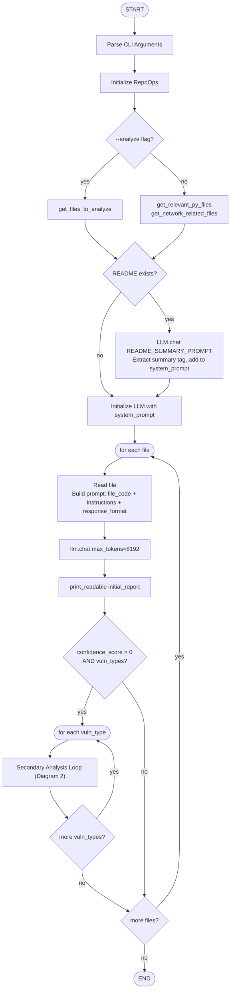
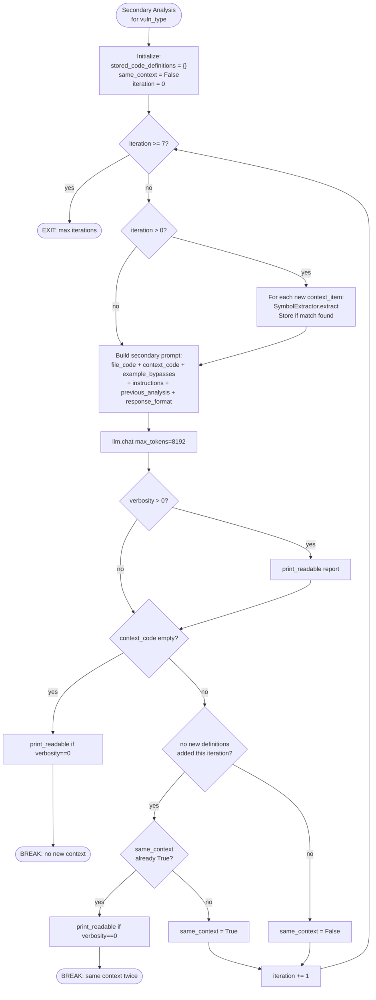
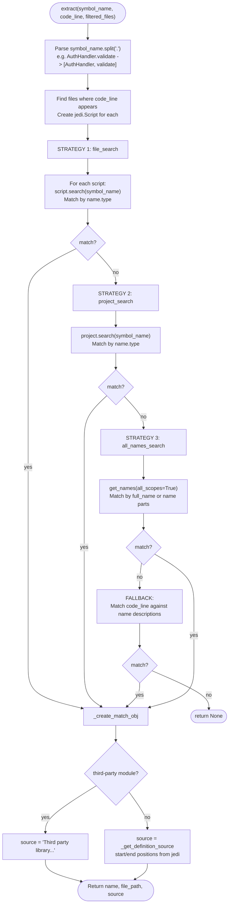
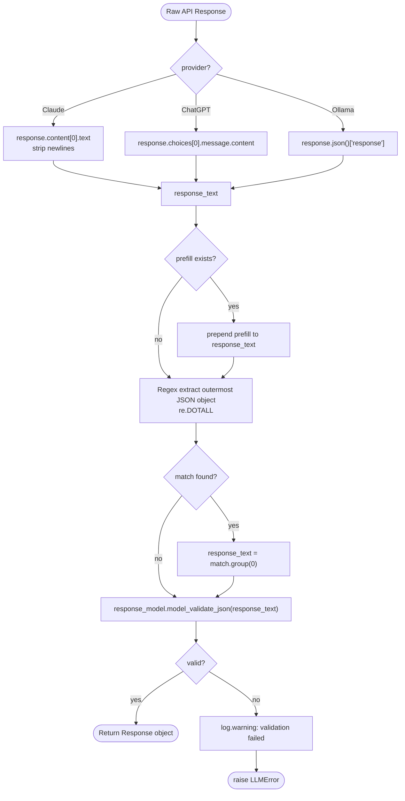

# Process Flow Diagrams

Flowcharts for the major subsystems.

---

## Diagram 1: Overall System Flow

---

## Diagram 2: Secondary Analysis Loop

---

## Diagram 3: Symbol Resolution Flow

---

## Diagram 4: LLM Response Processing

